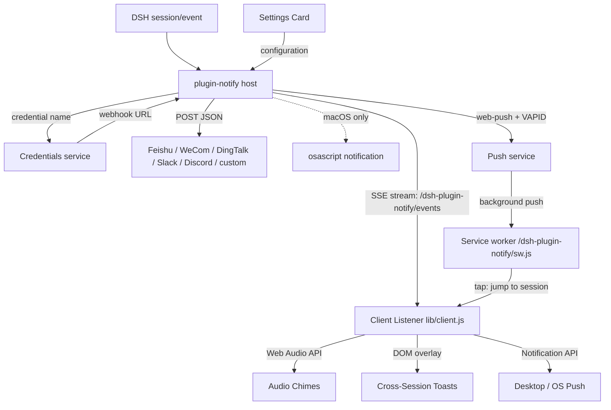

# 📦 @goodandready/dsh-plugin-notify

<div align="center">

<h3>Remote IM webhooks for turn done, errors, and approval waits</h3>

<p align="center">
  <a href="https://www.npmjs.com/package/@goodandready/dsh-plugin-notify"></a>
  <a href="LICENSE"></a>
  <a href="https://github.com/topics/dsh-plugin"></a>
  <a href="https://nodejs.org"></a>
</p>

<p align="center">
  <a href="https://goodandready.app/"></a>
</p>

<p align="center">
  <a href="README.md"><b>🇬🇧 English</b></a> •
  <a href="README.zh.md"><b>🇨🇳 中文说明</b></a> •
  <a href="README.ru.md"><b>🇷🇺 Русский</b></a>
</p>

<table align="center">
  <tr>
    <td align="center">
      ⭐ <strong>If you like this plugin, please star it on GitHub</strong> — it shows me that the plugin is useful to you and motivates me to keep developing it.
      <br><br>
      🐛 <strong>If you find a bug or would like to request a feature</strong>, open a GitHub issue in any language — I will review your proposal and implement useful suggestions in a future plugin version.
    </td>
  </tr>
</table>

</div>

---

## Overview / The Problem

DeepSeek Harness already knows when a turn finished, failed, or is waiting for approval. Without this plugin, those events remain confined inside the session. If you are working across multiple parallel sessions or minimized in another app, you have to keep manually checking back.

This plugin bridges that gap across five flexible notification layers:
1. **Audio Chimes**: Synthesized Web Audio pentatonic chimes that play immediately upon turn completion, failure, or approval requests without external audio files.
2. **Cross-Session Toasts**: On-screen floating banners that alert you across sessions with an interactive **"Go to session"** button to jump directly to the session that fired the event.
3. **Desktop / OS Push Notifications**: Native Windows, macOS, Linux, and DSH Desktop notifications via HTML5 `Notification API` with window focus and session switching on click.
4. **Remote IM Webhooks**: Outbound JSON webhooks for Feishu, WeCom, DingTalk, Slack, Discord, or generic custom endpoints. Webhook URLs are kept secret in DSH Credentials.
5. **Web Push (PWA)**: True background push via the W3C Push API and a service worker — your phone or desktop gets notified **even when every dsh browser tab is closed** (the other browser channels require an open tab). Tapping the notification opens dsh directly on the triggering session. HTTPS (or localhost) required; on iOS the PWA must be added to the Home Screen (iOS 16.4+).

## Architecture



## Feature breakdown

### Host (`lib/index.js`)

- Subscribes to `session/event`.
- `turn/end` with `reason.kind === 'completed'` → `task_done`.
- `turn/end` with any other reason → `error`.
- `approval/asked` → `approval_requested`.
- Streams real-time notifications to connected clients via SSE (`GET /dsh-plugin-notify/events`) on the Cordis `webServer` service.
- Resolves each `webhooks.*` value as: legacy `http(s)://` URL (deprecated warning) → Credentials `resolve(credentialRef(name))` → `process.env[name]`.
- Posts with `AbortSignal.timeout(timeoutMs)` (default 5000 ms). Failed POSTs are logged and never retried, and they never block the agent loop.
- Optional DND window (`HH:MM`, including overnight ranges). Events are still observed; webhooks, chimes, and local popups are skipped.
- `excludeSessionPrefixes` skips sessions whose id starts with a configured prefix.
- **Web Push host**: `webPush.enabled` turns on the Push API channel. Deliveries are skipped while an SSE client is connected when `webPush.onlyWhenAway` is on (default), so you are not buzzed while watching.
  - Routes: `GET /dsh-plugin-notify/push/key` (VAPID public key), `POST /dsh-plugin-notify/push/subscribe`, `POST /dsh-plugin-notify/push/unsubscribe`, `POST /dsh-plugin-notify/push/test`, `GET /dsh-plugin-notify/sw.js` (service worker; served with `Service-Worker-Allowed: /`). The four push routes use the same trust fence as the SSE stream.
  - VAPID keys are generated on first use and persisted to the state file; set `DSH_NOTIFY_VAPID_PUBLIC_KEY` + `DSH_NOTIFY_VAPID_PRIVATE_KEY` to manage them yourself. Subscriptions persist in the same file (default `$DSH_HOME/plugin-notify-state.json`, override with `webPush.stateFile`).
  - Dead subscriptions (push service answers 404/410) are pruned automatically. A slow or failing push service never blocks the agent loop.

### Client (`lib/client.js`)

- Native settings card on `settings.plugin.item`.
- Web Audio API dual-tone chime synthesizer for `task_done`, `error`, and `approval_requested` with interactive "Test sound" button.
- Non-intrusive floating toast manager with session navigation button and interactive "Test toast" button.
- Native HTML5 desktop push integration with permission request workflow.
- Web push: service-worker registration (document-relative, survives `--public-url` proxy mounts), permission + subscription flow, "Enable push on this device" and "Test push" buttons with live status, and `?dshNotifySession=<id>` deep-link handling (plus service-worker `postMessage`) that lands on the triggering session.
- Real-time SSE subscriber with exponential-backoff auto-reconnect and optional `notifyBackgroundOnly` filter.
- Snapshot status `loading` / `unavailable` / `ready` before the form is writable.
- Save writes every field and lists named failures.
- Locale dictionaries: `en` and `zh` only. Russian UI is supplied at runtime by `dsh-russian-lang`.
- Injected stylesheet is tagged `data-dsh-plugin="dsh-plugin-notify"`.

## Install

Install via the DSH web profile:

```sh
dsh plugin --profile web add @goodandready/dsh-plugin-notify
```

Restart the web profile so the client half loads. Then open **Settings → Plugins → Notify**.

## Configuration

Put each webhook URL into **Settings → Credentials**. In the plugin card, type only the credential name.

```yaml
- id: plugin-notify
  name: '@goodandready/dsh-plugin-notify'
  config:
    enableSound: false
    enableToasts: false
    enableDesktopNotifications: false
    notifyBackgroundOnly: false
    webhooks:
      feishu: NOTIFY_FEISHU_WEBHOOK
      wecom: NOTIFY_WECOM_WEBHOOK
      dingtalk: NOTIFY_DINGTALK_WEBHOOK
      slack: NOTIFY_SLACK_WEBHOOK
      discord: NOTIFY_DISCORD_WEBHOOK
      custom: NOTIFY_CUSTOM_WEBHOOK
    events: [task_done, error, approval_requested]
    local: true
    timeoutMs: 5000
    dnd:
      start: ''
      end: ''
    includeSession: true
    includeDuration: true
    excludeSessionPrefixes: []
    webPush:
      enabled: false
      onlyWhenAway: true
      subject: 'mailto:notify@localhost'
      stateFile: ''
```

| Parameter | Type | Default | Description |
|---|---|---|---|
| `enableSound` | boolean | `false` | Synthesize gentle Web Audio chimes on turn finish, error, or approval wait (opt-in). |
| `enableToasts` | boolean | `false` | Show cross-session on-screen banner toasts with interactive session switching (opt-in). |
| `enableDesktopNotifications` | boolean | `false` | Show native OS push notifications via HTML5 Notification API (opt-in). |
| `notifyBackgroundOnly` | boolean | `false` | Only trigger audio, toasts, and push when event is from an inactive/background session. |
| `webPush.enabled` | boolean | `false` | Web Push (PWA) channel: background push that reaches devices with every dsh tab closed (opt-in). |
| `webPush.onlyWhenAway` | boolean | `true` | Skip web push while a browser client is connected to the SSE stream. |
| `webPush.subject` | string | `mailto:notify@localhost` | VAPID subject (mailto:/https: contact) advertised to push services. |
| `webPush.stateFile` | string | empty | State file for VAPID keys and subscriptions (default `$DSH_HOME/plugin-notify-state.json`). |
| `webhooks.*` | string | empty | Credential **name** whose value is the webhook URL. Empty disables the channel. |
| `events` | string[] | `task_done`, `error`, `approval_requested` | Event whitelist. Empty restores the default three. |
| `local` | boolean | `true` | macOS `osascript` popup; ignored on other platforms. |
| `timeoutMs` | number | `5000` | Per-request abort timeout. |
| `dnd.start` / `dnd.end` | string | empty | `HH:MM` window. Equal or invalid values disable DND. |
| `includeSession` | boolean | `true` | Append `Session: …` to the text body. |
| `includeDuration` | boolean | `true` | Append `Duration: …` when a turn start timestamp is known. |
| `excludeSessionPrefixes` | string[] | `[]` | Skip notifications when `session.id` starts with any prefix. |

A leftover raw `http(s)://` value in `webhooks.*` still posts, with a deprecation warning. Migrate it to Credentials.

### Enabling web push

1. In the plugin card, check **Enable web push channel** and save.
2. Click **Enable push on this device** and accept the browser permission prompt — the device subscribes and uploads its push endpoint to the host.
3. Click **Test push** to confirm delivery.

Desktop Chrome, Edge, Firefox, and Android Chrome work out of the box. On iOS, add dsh to the Home Screen first (iOS 16.4+). A secure context (HTTPS or `localhost`) is required — real deployments already terminate TLS at their reverse proxy. Unlike the other browser channels, web push reaches the device even when no dsh tab is running; with `webPush.onlyWhenAway` (default) it also stays quiet while you are actively watching.

## Message shape

| Channel | JSON body |
|---|---|
| Feishu | `{ msg_type: 'text', content: { text } }` |
| WeCom | `{ msgtype: 'text', text: { content: text } }` |
| DingTalk | `{ msgtype: 'text', text: { content: text } }` |
| Slack | `{ text }` |
| Discord | `{ content: text }` |
| custom | `{ text, kind, title, sessionId, durationMs, time }` |
| Web Push | `{ kind, title, body, sessionId, tag, ts }` (encrypted by the push service; ≤4 KB pointer payload, no secrets) |

Text body:

```
【Task done】short session title
Summary: …
Reason: completed
Duration: 3m 42s
Session: session-1
```

## Tests

From a clone:

```sh
npm install --no-audit --no-fund --no-package-lock
npm test
```

`pretest` runs `node --check` on `lib/index.js` and `lib/client.js`. `npm test` then runs `node --test test/*.test.mjs`.

The suite stubs `fetch` / the push sender. It does not call a real IM provider or push service. Live delivery needs a webhook you own (or a browser subscription, for web push).

Expected output:

```text
✔ public package identity matches host, client and patch sites
✔ client locale registration coexists with Russian language pack
✔ client apply does not register ru and can reload after effect dispose
✔ legacy raw webhook URL still posts (compat)
✔ credential ref resolves webhook URL via credentials service
✔ resolveWebhookValue prefers credentials then env
✔ missing credential name does not post
✔ each IM channel posts the expected body shape
✔ recipient HTTP failure does not throw out of the session loop
✔ AbortSignal.timeout is attached to webhook POST
✔ excluded session prefixes suppress notifications
✔ Config schema validates sound, toast, and desktop notification fields with opt-in defaults
✔ SSE route delegates authentication to DSH connection service with loopback fallback (issue #21 fix)
✔ SSE route falls back to loopback-only check when connection service is absent (issue #21 fix)
✔ client does not register settings.section slot (issue #16 fix)
✔ deliveries and warnings are routed through ctx.logger without console calls (issue #22 fix)
✔ cleanupTurnStarts purges stale turnStarts entries older than TTL (issue #32 fix)
✔ sendSseHeartbeat writes ping comment to active clients and purges failed clients (issue #33 fix)
✔ summarizeTurn safely reverse iterates events and handles missing session.events (issue #34 fix)
✔ textOf handles plain strings, arrays of blocks, and strings in arrays (issue #35 fix)
✔ lifecycle: apply -> dispose closes SSE clients, resets turnStarts, and isolates re-apply (issue #40 fix)
✔ web push delivers approval requests to stored subscriptions
✔ turn completion produces a task_done push honoring text options
✔ onlyWhenAway skips push while a browser client is connected
✔ onlyWhenAway=false pushes even with clients connected
✔ disabled web push never sends
✔ DND window suppresses push like every other channel
✔ event filter and session-prefix exclusions apply to push
✔ dead subscriptions (404/410) are pruned, live failures are not
✔ no subscriptions means no sends and no errors
✔ sw.js is served unauthenticated with scope and cache headers
✔ sw.js rejects non-GET with 405
✔ push routes refuse non-loopback peers when no connection service exists
✔ push routes honor connection.requestRejection like the SSE stream
✔ push/key: 404 while disabled, key material while enabled
✔ push/subscribe: persists valid subscriptions, rejects invalid bodies
✔ push/unsubscribe: removes by endpoint
✔ push/test: sends to stored subscriptions via the injected library
✔ push routes answer 405 on wrong methods
✔ generateVapidKeys returns base64url P-256 keys
✔ resolveStatePath: explicit stateFile wins, then DSH_HOME, then ~/.dsh
✔ loadState tolerates missing and corrupted files
✔ saveState round-trips and leaves no temp files behind
✔ getVapidKeys generates once, persists, then reuses
✔ getVapidKeys env override wins over the state file
✔ addSubscription validates and dedupes by endpoint
✔ removeSubscription removes and reports
✔ concurrent saveState calls serialize into a valid file
ℹ tests 48
ℹ pass 48
ℹ fail 0
```

## License

MIT © [GooDAnDReaDY](https://github.com/GooDAnDReaDY)

## Changelog

See [CHANGELOG.md](CHANGELOG.md) for full release and version history.

